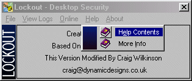



## Create Virtual Pull Down Menus With Icons & Bitmap

### Description

Allows you to create custom menus with icons and a bitmap down the left hand side as seen on some commercial products, The forms are dynamically created at runtime to cut down on memory.
 
### More Info
 

             |
---                |---
**Submitted On**   |2000-03-08 00:41:36
**By**             |[Craig Wilkinson](https://github.com/Planet-Source-Code/PSCIndex/blob/master/ByAuthor/craig-wilkinson.md)
**Level**          |Intermediate
**User Rating**    |5.0 (25 globes from 5 users)
**Compatibility**  |VB 5\.0, VB 6\.0
**Category**       |[Custom Controls/ Forms/  Menus](https://github.com/Planet-Source-Code/PSCIndex/blob/master/ByCategory/custom-controls-forms-menus__1-4.md)
**World**          |[Visual Basic](https://github.com/Planet-Source-Code/PSCIndex/blob/master/ByWorld/visual-basic.md)
**Archive File**   |[CODE\_UPLOAD3855372000\.zip](https://github.com/Planet-Source-Code/craig-wilkinson-create-virtual-pull-down-menus-with-icons-bitmap__1-6473/archive/master.zip)

### API Declarations

In Zip

